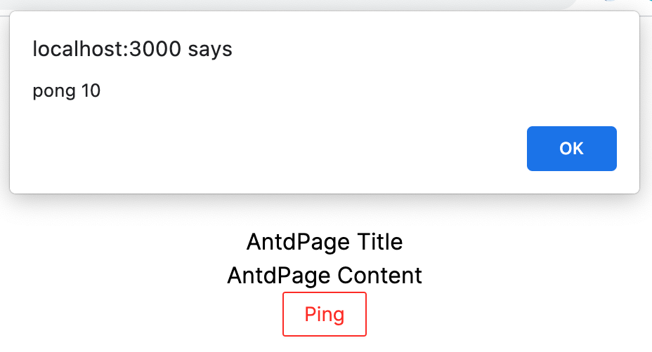
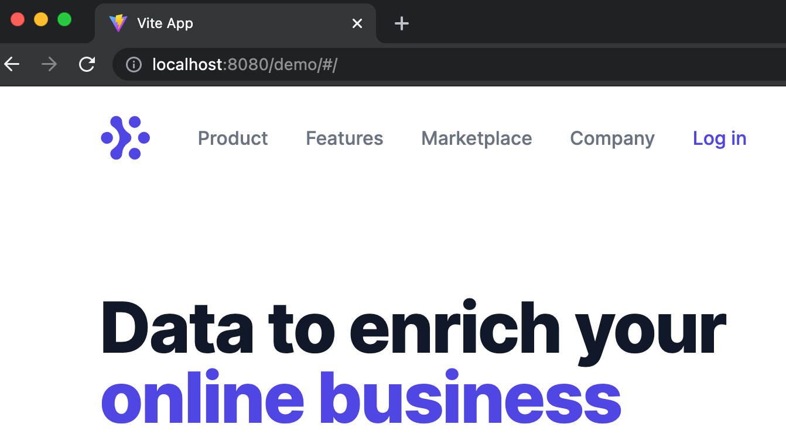
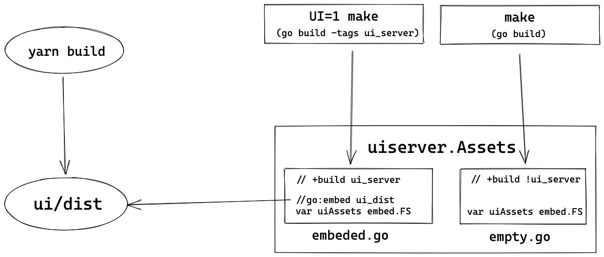
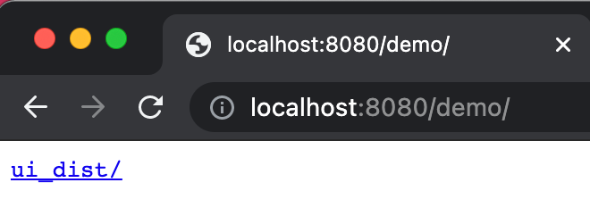

# 使用 vfsgen 和 go embed 打包 go web 项目

我们知道纯 go 代码的项目最终编译后会生成一个完全没有第三方依赖的二进制文件，非常方便部署。但如果这个项目有一些 assets 文件呢，比如最典型的 web 项目，里面会有 html, js, css 这些 assets 文件。

Go 1.16 之前，我们需要使用第三方工具来帮我们把这些 assets 文件转换成 go 代码，从而嵌入到最终生成的二进制文件中。其中之一就是 vfsgen。Go 1.16 后自带了原生的 embed 静态文件的功能。

我们使用一个前后端分离的 go web 项目作为 demo，后端使用 gin web 框架，前端使用 vite + react。

另外，我们只有在最终发布的时候才需要将前端编译生成的 html/js/css 这些 assets 嵌入到 go 代码中，开发的时候并不需要，不然每修改一次就要重新编译打包一次那就太麻烦了。使用 go 的条件编译可以在开发和生产模式上编译打包不同的文件，后面会详述。

我们先来看 vfsgen 的使用，然后再把它转换成使用 go 自带的 embed，可以进行一下对比。

## 使用 vfsgen

### 准备 demo

#### 准备 backend

首先使用 `go mod init gin-vite-vfsgen-demo` 创建一个 go 项目，安装 gin `go get github.com/gin-gonic/gin`，然后准备一个简单的 api 供前端调用。

```go
// main.go
package main

import (
	"net/http"
	"github.com/gin-gonic/gin"
)

var (
	pongCount = 0
)

func main() {
	router := gin.Default()
	// api
	api := router.Group("/api/v1")
	{
		api.GET("/ping", pingHanlder)
	}
	router.Run()
}

func pingHanlder(c *gin.Context) {
	pongCount += 1
	c.JSON(http.StatusOK, gin.H{
		"message": "pong",
		"count":   pongCount,
	})
}
```

使用 Makefile 管理编译：

```makefile
.PHONY: server

default: server

server:
	go build -o bin/web main.go

run:
	bin/web
```

执行 `make && make run` 把后端编译运行。

#### 准备前端项目

为了节省时间，直接从 https://github.com/baurine/try-vite/tree/main/vite-tailwind 拷贝一个前端项目。这是一个用 vite 创建的 react 前端项目，使用了 tailwind css 框架，不过这不重要，只是随手拿来用的。

进入 ui 目录执行 `yarn && yarn dev` 就可以把前端项目跑起来了，这个前端 demo 有三个简单的页面，相互间可以跳转。(有一点要注意，路由要使用 HashRouter，而不要使用 BrowserRouter)。

AntdPage 这个页面上有个 button，我们添加点击后去访问后端的 /api/v1/ping 接口，并将结果 alert 的逻辑。

当前前端跑在 localhost:3000 上，后端跑在 localhost:8080 上，发生了跨域，所以配置一下 dev server proxy。

修改 vite.config.js:

```js
// vite.config.js
export default defineConfig({
  server: {
    proxy: {
      '/api': 'http://localhost:8080',
    },
  },
  //...
}
```

在前端访问 /api/v1/ping 接口：

```jsx
export default function AntdPage() {
  function ping() {
    fetch('/api/v1/ping')
      .then((res) => res.json())
      .then((data) => {
        window.alert(`${data.message} ${data.count}`)
      })
  }

  return (
    <div className={styles.container}>
      {/*...*/}
      <Button onClick={ping}>Ping</Button>
    </div>
  )
}
```



这样 demo 就准备好了。

接下来我们的目标就是要把前端项目整体打包嵌入到后端代码中。

### 使用 vfsgen 进行嵌入

大致流程如下图所示。


在开发模式下，我们不需要在后端代码中嵌入前端代码，我们声明一个空的 ui assets，在头部用注释声明条件编译选项为 `// +build !ui_server`，如果编译命令中没有 `-tags ui_server` 选项，就会编译此文件；如果编译命令中包含 `-tags ui_server` 选项，则不会编译此文件。

而 `// +build ui_server` 则意味着只有编译命令中包含 `-tags ui_server` 才会编译此文件。

```go
// uiserver/empty_assets_handler.go
// +build !ui_server

package uiserver

import (
	"net/http"
)

// Assets represent the front-end assets
var Assets http.FileSystem = nil
```

再来看生产环境。

首先，我们执行 `yarn build` 编译打包前端项目，生成的文件会放在 ui/dist 目录下。

```
> tree ui/dist
ui/dist
├── assets
│   ├── favicon.17e50649.svg
│   ├── index.1236f1fd.js
│   ├── index.42881954.css
│   └── vendor.55f9bd99.js
└── index.html
```

接着我们写一个单独的 go 工具，调用 vfsgen.Generate() api 将 ui/dist 的所有文件转换到一个 go 文件中。

```go
// tools/gen_ui_assets/main.go
package main

import (
	"log"
	"net/http"
	"os"

	"github.com/shurcooL/vfsgen"
)

func main() {
	buildTag := ""
	if len(os.Args) > 1 {
		buildTag = os.Args[1]
	}
	var fs http.FileSystem = http.Dir("ui/dist")
	err := vfsgen.Generate(fs, vfsgen.Options{
		BuildTags:    buildTag, // 如果不需要灵活性，可以将 buildTag 直接写成 ui_server
		PackageName:  "uiserver",
		VariableName: "Assets",
	})
	if err != nil {
		log.Fatalln(err)
	}
}
```

执行 `go run tools/gen_ui_assets/main.go ui_server` 命令，运行上面的 go 代码，然后在项目根目录下生成了 assets_vfsdata.go 的文件，可以稍微看一下它的内容，主要是把这些 assets 的文本转换成了 go 的 byte[] 类型数据。然后还实现了文件系统相关的接口，比如 Open()，Read()，Seek() 等方法。

```go
var Assets = func() http.FileSystem {
	fs := vfsgen۰FS{
		"/": &vfsgen۰DirInfo{
			name:    "/",
			modTime: time.Date(2021, 6, 20, 2, 7, 18, 130000000, time.UTC),
		},
		"/assets": &vfsgen۰DirInfo{
			name:    "assets",
			modTime: time.Date(2021, 6, 20, 5, 58, 48, 170000000, time.UTC),
		},
		"/assets/favicon.17e50649.svg": &vfsgen۰CompressedFileInfo{
			name:             "favicon.17e50649.svg",
			modTime:          time.Date(2021, 6, 20, 5, 58, 48, 170000000, time.UTC),
			uncompressedSize: 1524,

			compressedContent: []byte("\x1f\x8b\x08\x00\x00\x00\x00\x00\x02\xff\x9c\x94\x4f\x6f\x1b\x37\x10\xc5\xef\xf9\x14\x03\xe6\xd2\x1e\x3a\x9a\xff\x9c\x29\xb2\x01\x92\x75\xd4\x8b\x8a\x1e\x8a\x5c\x7a\x29\x8c\x58\xb6\x05\xb8\x92\x61\x29\xb1\xf3\xed\x0b\xae\x13\xa0\xea\x5f\xa0\x7b\x20\xf0\x38\x6f\x49\xfe\x38\x0f\x7c\x75\xfc\x74\x03\x8f\xbb\xab\xd3\xed\xd4\x8c\xa9\xc1\xed\x76\x77\x73\x7b\x9a\x9a\x91...")
		}
		// ...
	}
}
// ...

func (fs vfsgen۰FS) Open(path string) (http.File, error) {
	path = pathpkg.Clean("/" + path)
	f, ok := fs[path]
	if !ok {
		return nil, &os.PathError{Op: "open", Path: path, Err: os.ErrNotExist}
	}
	// ...
}
```

我们把这个文件重命名并移动到 uiserver 目录下，`uiserver/embeded_assets_handler.go`。

把上面的几步操作一起写到一个 shell `tools/embed_asstes/embed_ui_assets.sh` 脚本中，调用方便一些。包括检查 ui/dist 是否存在，调用 vfsgen main.go，移动生成的 go 文件。

修改 Makefile，添加 `make embed_ui` 命令，执行编译前端并调用上面的脚本的工作。

```Makefile
embed_ui:
	cd ui && yarn && yarn build
	tools/embed_assets/embed_ui_assets.sh
```

并修改 `make server` 命令，添加 `UI=1` 时使用 `-tag ui_server` 选项进行生产环境的编译，嵌入前端代码。

```Makefile
server:
ifeq ($(UI),1)
	go build -tags ui_server -o bin/web main.go
else
	go build -o bin/web main.go
endif
```

因此，完整的命令：`make embed_ui && UI=1 make`

### 使用 assets

如上操作后，前端代码已经打包到最终的 go 二进制文件，把二进制运行起来后，这些前端代码会被加载到 uiserver.Assets 这个全局变量中。

接着我们要把这些 assets 注册到 gin 的路由中，一般说来，前端页面的入口我们会挂载到 `/` 路由下，但在 gin 中我们如果尝试下面这样做，运行时会崩溃。

```go
	router.StaticFS("/", uiserver.Assets)
```

报的错是路由冲突：

```
[GIN-debug] GET    /api/v1/ping              --> main.pingHanlder (3 handlers)
[GIN-debug] GET    /*filepath                --> github.com/gin-gonic/gin.(*RouterGroup).createStaticHandler.func1 (3 handlers)
panic: catch-all conflicts with existing handle for the path segment root in path '/*filepath'
```

各种尝试失败后我们只好把 uiserver.Assets 挂载到一个具名的路由下，比如 `/demo`。并且我们加上重定向，让用户访问首页时可以自动重定向到 `/demo` 页面。

```go
	router.StaticFS("/demo", uiserver.Assets)
	router.GET("/", func(c *gin.Context) {
		c.Redirect(http.StatusMovedPermanently, "/demo")
		c.Abort()
	})
```

但此时我们去浏览器访问 localhost:8080/demo 时，发现前端代码并没有加载提示，console 中提示这些资源 404。

```
GET http://localhost:8080/assets/vendor.55f9bd99.js net::ERR_ABORTED 404 (Not Found)
GET http://localhost:8080/assets/index.42881954.css net::ERR_ABORTED 404 (Not Found)
GET http://localhost:8080/assets/index.d7c35f81.js net::ERR_ABORTED 404 (Not Found)
```

原因是我们将 assets 挂载到了 `/demo` 路由下，那么这些 assets 的完整路径不再是 `/assets/vendor.55f9bd99.js`，而是 `/demo/assets/vendor.55f9bd99.js`。

vite 编译前端代码时默认根目录是 `/`，我们修改它的配置，把默认根目录改成 `/demo/`。

```js
// vite.config.js
export default defineConfig({
  base: '/demo/',
  //...
})
```

再次 `yarn build` 后查看 ui/dist/index.html，发现引入的资源路径前面都加上了 `/demo/`。

```html
<script type="module" crossorigin src="/demo/assets/index.1236f1fd.js"></script>
<link rel="modulepreload" href="/demo/assets/vendor.55f9bd99.js" />
<link rel="stylesheet" href="/demo/assets/index.42881954.css" />
```

再次 `make embed_ui && UI=1 make && make run`，访问 localhost:8080 后，自动重定向到 localhost:8080/demo，可以正确加载前端页面。



## 使用 go embed

接下来我们来使用从 go 1.16 开始原生的 go embed 功能。

go embed 功能介绍，可以看下面的参考文章：

- [go 1.16 新功能 - go embed](https://mp.weixin.qq.com/s/R33JTORMZ1jVg8GAowpf4g)
- [Embedding Vue.js Apps in Go](https://hackandsla.sh/posts/2021-06-18-embed-vuejs-in-go/)

简单来说，通过下面两行语句就可以把 ui/dist 目录里所有文件直接嵌入 go 代码里，替代前面使用 vfsgen 生成 `embedded_assets_handler.go` 的操作。

```go
// main.go

//go:embed ui/dist
var uiAssets embed.FS
```

不过我们还是继续遵循开发模式下不嵌入前端代码，只在生产模式下嵌入前端代码的逻辑。则流程如下所示：



我们在 uiserver 下创建 `empty_assets.go` 和 `embedded_assets.go` 两个文件，前者声明一个加载空目录的 embed.FS assets，用于开发模式；后者用于加载真正的 ui assets，用于最终的发布。

由于 go embed 限制了只能从 go 文件所在目录中加载静态文件，而前端编译后生成的输出文件放在 ui/dist 中，并不在 uiserver 中，所以我们要先把 ui/dist 移动中 uiserver/ui_dist 目录中。

修改 Makefile，`yarn build` 后移动目录。

```Makefile
embed_ui:
	cd ui && yarn && yarn build
	rm -rf uiserver/ui_dist
	mv ui/dist uiserver/ui_dist
```

在 `empty_assets.go` 中声明空 assets。

```go
// uiserver/empty_assets.go
// +build !ui_server

package uiserver

import (
	"embed"
)

// Assets represent the frontend ui assets
// empty ui assets
var Assets embed.FS
```

在 `embedded_assets.go` 中声明从 ui_dist 中加载的 assets。

```go
// uiserver/embedded_assets.go
// +build ui_server

package uiserver

import (
	"embed"
)

// Assets represent the frontend ui assets
//go:embed ui_dist
var Assets embed.FS
```

main.go 中使用 Assets 的代码稍做调整：

```go
// main.go
router.StaticFS("/demo", http.FS(uiserver.Assets))
```

执行 `make embed_ui && UI=1 make && make run` 进行测试，访问 localhost:8080，得到的是下面这样的结果：



而不是预期中的 index.html。

这是因为下面的语句得到的 Assets 中每一个文件都是以 `ui_dist` 为根目录，它们的路径都是以 `ui_dist` 开头，比如 index.html，实际是 `ui_dist/index.html`。

```go
//go:embed ui_dist
var Assets embed.FS
```

我们将 `ui_dist` 的下一级目录作为这些 assets 的根目录，就可以把 `ui_dist` 从 assets 的路径中 strip 掉，可以使用 fs.Sub() 方法。使用 uiserver/uiserver.go 封装一下。

```go
// uiserver/uiserver.go
package uiserver

import (
	"io/fs"
	"net/http"
)

func Assets() http.FileSystem {
	// even uiAssets is empty, fs.Sub won't fail
	stripped, err := fs.Sub(uiAssets, "ui_dist")
	if err != nil {
		panic(err)
	}
	return http.FS(stripped)
}
```

修改 main.go。

```go
// main.go
router.StaticFS("/demo", uiserver.Assets())
```

测试发现可以得到预期结果。

All done!
